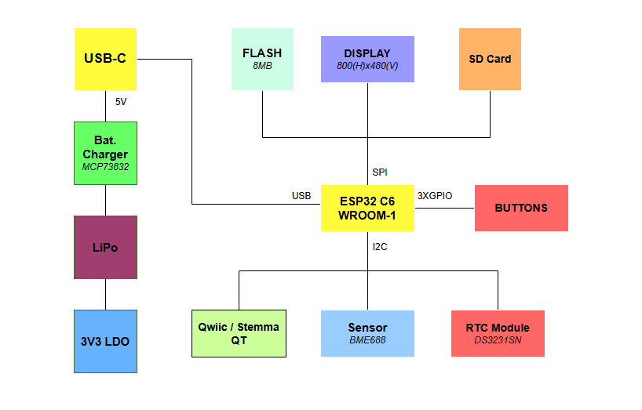

# TSC_E-BookReader

## Diagrama bloc:

## Pasi de implementare:

- Am creat **schema electrica** pe baza celei atasate in cerinta, folosind biblioteca `DeskAssistant`
- Am creat apoi **PCB**-ul:
    - am modificat dimensiunile PCB-ului pentru a corespunde cu cele descrise in cerinta
    -  am plasat componentele in functie de schema electrica, grupandu-le pe baza 'functionalitatii'
    -  am decupat PCB-ul conform fisierului atasat in enunt
    -  am modificat denumirile *test-pad-urilor* - *TP* in functie de semnalele pe care le poarta
    -  am facut autorutare cu dimensiunile traseelor de alimentare precizate in enunt (`VBUS`, `VUSB`, `VBAT`, `3V3`, `EPD_3V3` si `EPD_3V3_C` cu *CopperWidth* de minimum **0.3 mm**, iar restul cu *CopperWidth* de minimum **0.15 mm**)
    -  am trasat planurile de masa (*top* si *bottom*)
- Am introdus modelele **3D**:
    - am descarcat modelele 3D corespunzatoare de pe [Component Search Engine](https://componentsearchengine.com/)
    - am editat fiecare componenta, adaugandu-i modelul 3D pe care l-am pozitionat conform *pinilor* / *footprint-ului*
- Am desenat modelele **3D** pentru *baterie*, *ecran* si *test-pad-uri* tinand cont de dimensiuni
- Am adaugat toate piesele (*placuta*, *ecranul*, *bateria* si *carcasa*) obtinand produsul final

## Descriere functionalitate hardware:

### 1. Alimentare și Protecție (USB-C & ESD)
- **Conector USB-C**: permite alimentarea plăcii și comunicarea de date.
- **PFMF.050.1**, **TVS diode (D1)**: oferă protecție la supratensiuni și descărcări electrostatice.
- **IC1**: convertește tensiunea de intrare (5V) la 3.3V, necesară pentru alimentarea circuitelor logice (ESP32, senzori, etc.).

### 2. Control Alimentare Baterie
- **MCP73831** este un controler de încărcare pentru baterii Li-Po.
- **C1, C2** filtrează zgomotele pe linia de alimentare.
- Permite alimentarea sistemului din baterie reîncărcabilă și oferă protecție la supraîncărcare/descărcare.

### 3. Nivel Încărcare Baterie
- **MAX17048** măsoară nivelul de încărcare al bateriei.
- Comunicarea se face prin magistrala I2C (SCL/SDA), comună cu alți senzori.
- Permite afișarea nivelului bateriei pe ecran sau transmiterea sa prin rețea.

### 4. Afișaj E-Paper
- **Header E-Paper** conectează un afișaj de tip E-Ink.
- **Driverul de semnal (MBR0530, L1, Q3)** controlează alimentarea și semnalele de comutare pentru afișaj.
- Selectarea tipului de ecran se face cu jumperul **S1**.
- Afișajul e-paper este ideal pentru consum redus de energie.

### 5. Modul RTC (Ceas în timp real)
- **DS3231SN** menține ora exactă, chiar și când placa este oprită.
- Funcționează pe I2C și are o baterie de rezervă.

### 6. Senzor Ambiental (BME688)
- Măsoară temperatură, umiditate, presiune și calitatea aerului.
- Se conectează la ESP32 prin I2C.

### 7. Memorie NOR Flash externă (64MB)
- **W25Q512JVEIQ** este o memorie SPI folosită pentru stocare extinsă (ex: cărți, imagini, date).
- Conectată la ESP32 pe interfață SPI (IO4–IO7).
- Permite stocarea persistentă a fișierelor.

### 8. Cititor Card SD
- Slot SD conectat prin SPI (IO8–IO11).
- Permite acces la fișiere externe, jurnalizare sau încărcare de date din card.

### 9. ESP32-C6 - Microcontroller Principal
- Conectează toate perifericele și controlează logica sistemului.
- Suportă Wi-Fi 6, BLE 5.2 și Zigbee/Thread.
- Are GPIO configurate pentru SPI, I2C, UART și control E-Paper.
- Este nucleul care rulează software-ul aplicației.

### 10. Protecții ESD pe SPI & Qwiic
- Diodă **TVS** și rezistențe pe liniile SPI/Qwiic pentru protecție la ESD.
- Asigură durabilitate mai mare în aplicații reale.

### 11. Butoane - Reset & Boot
- Buton **RESET**: Repornește ESP32.
- Buton **BOOT**: Permite intrarea în mod de boot pentru programare.
- Ambele conectate la pini critici (EN, IO0).

### 12. Interfață Qwiic / Stemma QT
- Conector I2C standard (JST-SH 4 pini).
- Permite adăugarea rapidă de senzori sau module adiționale compatibile.

### 13. Test Pads
- Paduri expuse pentru GPIO-uri esențiale.
- Permit depanarea, măsurători și extinderea funcționalității.

---

## Descrierea pinilor ESP32-C6:

| Pin ESP32-C6 | Nume Semnal     | Componentă Asociată                   | Scop / Funcție                                           |
|--------------|------------------|----------------------------------------|-----------------------------------------------------------|
| GND          | GND              | Toate componentele                     | Masă comună pentru alimentare și semnal.                  |
| EN           | Enable           | Buton Reset                            | Resetează microcontrollerul la apăsare.                   |
| IO0          | GPIO0            | Buton BOOT                             | Intrare în modul de boot la apăsare.                      |
| IO1          | GPIO1            | Test Pad TP11                          | Test/debug sau I/O general.                               |
| IO2          | GPIO2            | Test Pad TP12                          | Test/debug sau I/O general.                               |
| IO3          | GPIO3            | Test Pad TP13                          | Test/debug sau I/O general.                               |
| IO4          | GPIO4            | SPI Flash (CS)                         | Chip Select pentru memoria NOR Flash externă.             |
| IO5          | GPIO5            | SPI Flash (CLK)                        | Clock SPI pentru memoria NOR Flash externă.               |
| IO6          | GPIO6            | SPI Flash (MISO)                       | Data Out din NOR Flash spre ESP32.                        |
| IO7          | GPIO7            | SPI Flash (MOSI)                       | Data In către NOR Flash de la ESP32.                      |
| IO8          | GPIO8            | SD Card (CS)                           | Chip Select pentru card SD.                               |
| IO9          | GPIO9            | SD Card (CLK)                          | Clock SPI pentru card SD.                                 |
| IO10         | GPIO10           | SD Card (MISO)                         | Date de pe card SD către ESP32.                           |
| IO11         | GPIO11           | SD Card (MOSI)                         | Date de la ESP32 către card SD.                           |
| IO12         | GPIO12           | E-Paper Header                         | Semnal pentru ecran E-Paper (ex: BUSY, RST etc.).         |
| IO13         | GPIO13           | E-Paper Header                         | Semnal pentru ecran E-Paper.                              |
| IO14         | GPIO14           | E-Paper Header                         | Semnal pentru ecran E-Paper.                              |
| IO15         | GPIO15           | E-Paper Header                         | Semnal pentru ecran E-Paper.                              |
| IO16         | GPIO16           | SCL (RTC & BME688)                     | I2C Clock comun pentru RTC și senzor de mediu.            |
| IO17         | GPIO17           | SDA (RTC & BME688)                     | I2C Data comun pentru RTC și senzor de mediu.             |
| IO18         | GPIO18           | UART_RX (Qwiic/Debug)                  | Recepție serială (debug sau Qwiic/StemMA).                |
| IO19         | GPIO19           | UART_TX (Qwiic/Debug)                  | Transmisie serială (debug sau Qwiic/StemMA).              |

## Bill of Materials (BOM):

[Bill Of Materials](https://docs.google.com/spreadsheets/d/1Q_EdtGEQtIujOwCTEiCneIGeXAIIT7IC10t8W7WPvTo/edit?gid=126355067#gid=126355067)

| Component | Link | Datasheet |
|-----------|-------|----------|

## Probleme:

- Am aprobat 2 erori tip *SMD-Hole* la rutarea *PCB-ului*
- Am aprobat erorile de tip *part X has no value* sau *pin X connected to Y* ce apareau dupa rularea *ERC-ului* in schematic